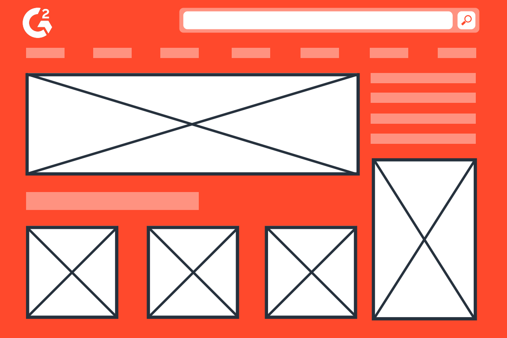

# Ed's Code Journal

2022 Sait WBDV Code Journal

## January 13th, 2022

Goal: Update "website" and push it to GitHub
Getting a login problem, not exactly sure what's wrong. A little frustrated ngl.
Adding and committing is getting etched into my memory now, just need to figure out this push problem

- Tried to push to git for the first time
- Having a few problems
- Might need to set up SSH keys
- Set up SSH key but still unable to push lol
- Used trusty ol' Google to figure out how to change it from HTTPS to SSH so I can finally push

## January 13th pt. 2

- Git collaboration with a partner
- made a new repo and invited Jason to be a contributor
- had a little trouble pushing a static html template to git bash/VS code
- finally started playing "commit catch" with partner
  After a couple back and forth commits we created a merge conflict by working on the same line of code and having one person try to push without pulling first.
- Commit catch is actually kinda fun lol

## January 14th

Not doing anything too crazy today
Goal: embed an image into a markdown

- learned some stuff about copyright and licenses
- forgot how to do that so I'll watch the recording again
- Had a guest speaker come in and talk about how she got through the class
- had UX explained a little bit

## January 17th

Goal get sort of comfortable with UX I guess

- Learned about user stories and how to make a good one
- Tony explained gists but I think I'm gonna stick to making repos the first way I learned
- Wrote down some user flow scenarios in my notebook, will enter them into a markdown for assignment
- [Read a little bit about wireframes](https://careerfoundry.com/en/blog/ux-design/what-are-user-flows/)
- Tried drawing a wireframe by hand that matched one of my user flow scenarios
- Looked through the markdown cheat sheet found this code ``

**Picture didn't show up how I wanted or expected, will ask Tony next time about how to fix the problem**

 "Wireframe example"

Image Source: https://www.g2.com/articles/wireframe

## January 18th

Goal: Work on Dsgn270 assignment 1

- Started creating a wireflow on Figma not going so well
- Not sure how to get icons from Font Awesome into Figma
- Finished most of the content for assignment, just trying to figure out how to make this wireflow
- This is not working, might have to draw it by hand if I can't figure it out

## January 19th

Goal: Finish Dsgn270 assignment 1

Watched the video on [reading hex color codes](https://www.youtube.com/watch?v=eqZqx6lRPe0) that stuff makes a lot of sense now

- Did a bunch of practice with read hex codes, getting the hang of it but still gotta remember most of the line graph shapes so I actually know what the hue/colour is
- So I finally figured out how to get icons into Figma with Tony's help
  - This site has plugins and downloads for a lot of icons useful in making wireflows and websites: [UIPrep](<https://www.uiprep.com/blog/ultimate-guide-to-using-icons-in-figma#:~:text=Add%20icons%20to%20your%20Figma,a%20plugin%20(most%20recommended).>)
- Making the wireflow screens was very hard for some reason, took me a few hours
- Having to zoom in every single time to find an icon I just added was really annoying

Good news, finished wireflow half of the assignment now I just need to figure out how to get that downloaded picture into my markdown.

## January 20th

Goal: Finish CPNT260 Wiki Article

Ash explained the basics of HTML and CSS on CodePen so that was really helpful

- Made my own replica of a [One Piece article from wikipedia](https://codepen.io/ykeddie/pen/jOGjGMM)
- I think I'm starting to get the hang of HTML and CSS, definitely going to have to practice a lot more
- Figuring out how to fix all the dimensions for pictures and borders etc. is surprisingly difficult
- The [video on hex code colours](https://www.youtube.com/watch?v=eqZqx6lRPe0) was really useful cause I was able to actually make the background of a box a specific color/shade rather than just typing in "red" or "blue"
- My codepen assignment honestly isn't the best but I'm sure with practice I'll be able to improve
- Need to learn how to shift the whole paragraph to the middle (would've made it look nicer before handing in)

Was able to finish Wiki Article, gonna start on my other assignment

## January 24th

Goal: Just mess around with flexbox

[Codepen I'm working on](https://codepen.io/ykeddie/pen/jOaNXmv)

- I am honestly a bit confused about a few things with flexbox and some things I'm good with
- Started working on a navigation bar (having a little trouble)
- There's a lot of things I need to remember such as
  - `flex-end`
  - `justifiy-content: center`
  - and how to properly use clamps

Made a README full of assets such as premade colour boards and keywords for the vision I have for projects. Think it's very useful.

- Also little tip Ash gave about making the root and presetting the colours as variables in CSS was quite helpful

## January 27/28th

Goal: Mess around with grid, figure out how to use it to sort pictures/images in a sort of gallery

- I think grid is way easier than flexbox, and it's honestly more simple to me
- The command `grid-template-colums: repeat(4, 1fr)` for example is really useful rather than having to type it out multiple times
- OKAY so grid is slightly easier, still a bit confusing gotta figure out all the lines and stuff

Worked on 404 Page

- Found some cool code that allows you to make text transparent and then fill it with an image/background
  - `-webkit-text-fill-color: transparent;`
  - `-webkit-background-clip: text;`

While working on Services Page A2 I tried to use media queries to have some stuff change but the values got all messed up so I just scrapped that part as a whole. Gonna try and make a random codepen and figure out media queries in there.

## February 1st

Messed around with making a gallery, getting the pictures in it was fairly easy but then the sorting of all of them proved to be quite the hassle

- Still haven't been able to figure out some parts of it, gonna go over the recording and maybe watch some YouTube videos

Did some extra research on hero sections and I have an idea of what I want to do for one but it would need some stuff that has to do with animations and transitions and I'm not sure if I wanna mess around with that just yet lol

- Codepen was bugging, I couldn't edit my CSS portion of my user input form even after restarting my laptop so it's looking very basic
- Looked at Ash's codepens for some inspo
- Want to incorporate the code I found last week into my hero section hopefully

## February 3rd

Well, that was rough. Took me too much time to finish that gallery assignment and it still didn't turn out the way I wanted it to.
I ended up using media queries to make the page responsive when it gets smaller because I couldn't figure out how to do it without one.

- [Messed up Gallery](https://ykeddie.github.io/cpnt260-a3/)

- Need to practice more on making pages responsive without a media query

Watched the recording again to see if there was something I was missing but I can't tell what it was.

When I was trying to initialize a repo through VS Code there was an error it kept giving me and it didn't allow my repo to work at first, I didn't really solve it I just did it from the start again and it worked so I'm not sure what was wrong with it

- `warning: LF will be replaced by CRLF in README.md. The file will have its original line endings in your working directory`

## March 19th/20th

Working on Figma and prototyping.

- Learning how to prototype is a very useful skill depending on the areas you want to work in
- It was a bit difficult though because I wasn't sure how all the connectors worked and where to start them from
- I used the stussy website as my example and tried to imitate the animations they have on their site

Before the prototyping I made a landing page and it went pretty well, I think using the grid especially helped in making everything look clean and even.

I was thinking about making a SVG to add onto the page but it took a lot of time just to make my first one and I didn't want to go through that again for no real benefit.
